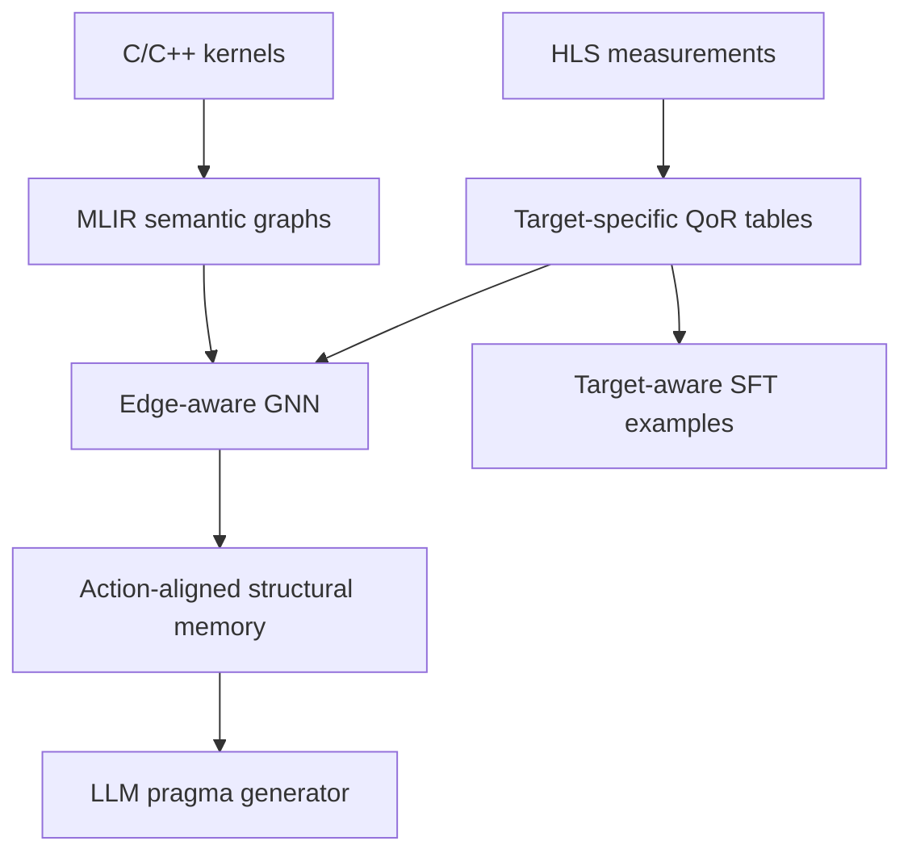

# MailoHLS

MailoHLS is a pipeline for **structure-aware HLS design-space
optimization**. It combines two complementary models:

- an edge-aware GNN learns kernel structure and predicts latency/area from a 
  MLIR graph and a pragma configuration;
- an LLM generates a complete legal pragma assignment for a kernel, objective,
  target FPGA, clock period, and resource budget.

The final system uses action-aligned GNN representations as structural
memory for the LLM. 



## Repository map

```text
Data/
├── ApplicationDataset/          labeled C/C++ sources and kernel_info.txt
├── ApplicationAPLMapping/       synthesis-CSV column -> source action ID
├── ApplicationInformation.csv   top function and source-file metadata
└── CSVS/                        raw multi-device/multi-clock HLS measurements

Preprocessing/
├── data_preprocess.py           validated GNN/LLM QoR preprocessing
└── create_jsonl.py              deterministic target-aware SFT builder

GNN_branch/
├── mlir_graph_gen.py            one source kernel -> one semantic GEXF graph
├── generate_mlir_dataset.py     reproducible 55-kernel graph driver
├── mlir_data.py                 GEXF + QoR points -> PyG samples
├── model.py                     edge-aware TransformerConv architecture
├── train_GNN.py                 training, model selection, and evaluation
├── main_GNN.py                  command-line entry point
└── MLIR_graphs/                 published graphs, audit MLIR, logs, manifest

LLM_branch/train/
└── train_SFT_xattn_new.py       target-aware Stage-1/Stage-2 SFT trainer
```

Older HARP graph builders, SFT scripts, and inference scripts are retained as
research history. The files named above define the current path.

## 1. Environment

Create a Python environment:

```bash
python3 -m venv .hls-llm
source .hls-llm/bin/activate
python -m pip install --upgrade pip
python -m pip install -r requirements.txt
```

`requirements.txt` records the development environment. PyTorch/CUDA wheels may
need to be selected for the local GPU before installing the remaining packages.

MLIR graph generation additionally requires the project’s patched Polygeist
build, Python 3.11 MLIR bindings, and `_mailohls_analysis` extension. The PyPI
package named `mlir` is unrelated. Point all commands at one build:

```bash
export POLYGEIST_BUILD="$HOME/tools/Polygeist/build-mailohls-assertions"
export CGEIST="$POLYGEIST_BUILD/bin/cgeist"
export MLIR_PYTHON="$HOME/.mlir-python311/bin/python"
export MLIR_PYTHON_ROOT="$POLYGEIST_BUILD/tools/mlir/python_packages/mlir_core"
export PYTHONHASHSEED=0
export PYTHONPATH="$MLIR_PYTHON_ROOT"

"$CGEIST" --help | grep mailohls-action-manifest
"$MLIR_PYTHON" - <<'PY'
from mlir import ir
from mlir._mlir_libs import _mailohls_analysis
print("MLIR bindings:", ir.__file__)
print("MailoHLS analysis:", _mailohls_analysis.__file__)
PY
```

The compiler-side action preservation, Mem2Reg correction, and analysis binding
are currently maintained in the associated Polygeist working tree. A release
artifact must pin or publish that patch set; the Python repository alone cannot
reproduce graph generation.

## 2. Preprocess HLS measurements

`Data/CSVS/` is the immutable measurement source. The action metadata chain is:

```text
synthesis CSV column -> ApplicationAPLMapping -> kernel_info.txt -> source label
```

An active directive is accepted only when that chain is complete.

### GNN labels: one hardware target

The graph represents the kernel and pragma configuration; therefore the GNN
uses one device/clock so identical inputs do not receive conflicting QoR labels.

```bash
python Preprocessing/data_preprocess.py \
  --mode gnn \
  --device xczu7ev-ffvc1156-2-e \
  --clock-period-ns 10.0 \
  --force
```

### LLM labels: all measured targets

The target-aware LLM retains every device and clock and computes Pareto weights
within each hardware target:

```bash
python Preprocessing/data_preprocess.py --mode llm --force

python Preprocessing/create_jsonl.py --force
```

The second command writes `artifacts/llm/mailohls_sft.jsonl`: complete directive assignments plus
  device, clock, QoR, utilization, and a compact source key;


## 3. Generate MLIR graphs

```bash
PYTHONHASHSEED=0 PYTHONPATH="$MLIR_PYTHON_ROOT" \
"$MLIR_PYTHON" GNN_branch/generate_mlir_dataset.py \
  --force --keep-mlir
```

| Relation | Information represented |
|---|---|
| Structure/control | functions, regions, blocks, order, loops, and calls |
| SSA data flow | operands/results, block arguments, and loop-carried values |
| Memory | allocations, views, exact aliases, pairwise uncertain aliases, effects, and accesses |
| Dependences | proven affine RAW/WAR/WAW and explicitly marked conservative fallbacks |
| HLS actions | source-grounded pipeline, unroll, and array-partition scopes |


## 4. Build the PyG cache and train the GNN

The first run after any graph/feature change must include `--force_regen`:

```bash
export CUBLAS_WORKSPACE_CONFIG=:4096:8

PYTHONHASHSEED=0 python GNN_branch/main_GNN.py \
  --dataset mlir \
  --subtask train \
  --force_regen \
  --epoch_num 200 \
  --random_seed 123 \
  --experiment_name gnn_train_seed123 \
  --standardize_targets \
  --kernel_balanced_loss \
  --kernel_uniform_sampling \
  --scheduler plateau \
  --warmup_epochs 3 \
  --plateau_patience 4 \
  --early_stopping_patience 25 \
  --val_kernels machsuite-sort-radix,rodinia_pathfinder_0_baseline_0,rodinia_pathfinder_4_doublebuffer_0 \
  --test_kernels serrano-kalman-filter
```

The GNN reports inverse-transformed physical latency/area metrics, per-kernel
macro averages, and Kendall tau-b. The selected model must beat both the
training-mean baseline and the seeded untrained model on every validation target
before test evaluation is permitted.

## 5. Train the target-aware LLM

### Stage 1: directive-only baseline

This stage is runnable after creating the JSONL and does not require GNN memory:

```bash
python LLM_branch/train/train_SFT_xattn_new.py \
  --dataset artifacts/llm/mailohls_sft.jsonl \
  --objective ALL \
  --run_mode single \
  --disable_structural_memory \
  --device_mode known \
  --device_token_dropout 0 \
  --top_k 1 \
  --auto_frequency_fraction 0 \
  --output_dir checkpoints/sft_stage1 \
  --save_split_json artifacts/llm/family_split.json \
  --seed 123
```

The prompt conditions on device identity, exact clock, available resources, 
and optimization objective;
the target contains one deterministic value for every legal directive site.

### Optional automatic-clock task

The trainer can also ask the model to choose the best **measured** clock for the
same kernel/device/resource budget (disabled by default). It uses `<CLK=AUTO>`, 
lists the supported clock candidates, and emits `selected_clock_period_ns` before 
the directives:

### Stage 2: structural-memory conditioning

Stage 2 should begin only after the current GNN checkpoint can be exported as
one deterministic, zero-pragma, action-aligned memory pack per kernel. The
export must record graph/feature/checkpoint hashes and reject missing action
slots. 
